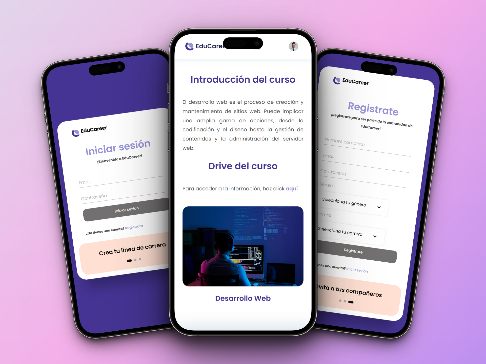

<div align="center">

  <h2 align="center">👨‍🏫📚👩‍🏫 EduCareer - Núcleo Sistemas 📔📎📐</h2>

  EduCareer is a fully responsive website, <br />Responsive for all devices, built with HTML, CSS, TypeScript and Angular. <br />This page will display a summary of each teacher.<br /> You can obtain material for classes (griddles, books, etc.)

  This project was generated with [Angular CLI](https://github.com/angular/angular-cli) version 16.2.10.

  <a href="https://educareer.netlify.app/"><strong>➥ Live Demo</strong></a>

</div>

<br />

### Demo Screeshots



### Prerequisites

Before you begin, ensure you have met the following requirements:

* [Git](https://git-scm.com/downloads "Download Git") must be installed on your operating system.

### Run Locally

To run **EduCareer** locally, run this command on your git bash:

Linux and macOS:

```bash
sudo git clone https://github.com/AnthonyAvellaneda10/EduCareer-Frontend.git
```

Windows:

```bash
git clone https://github.com/AnthonyAvellaneda10/EduCareer-Frontend.git
```

## Use

1. Clone this repository: `git clone https://github.com/AnthonyAvellaneda10/EduCareer-Frontend.git`

```shell
git clone https://github.com/AnthonyAvellaneda10/EduCareer-Frontend.git
```

2. Navigate to the project folder: `cd EduCareer-Frontend`

```shell
cd EduCareer-Frontend
```

3. Run `ng serve` for a dev server. Navigate to `http://localhost:4200/`. The application will automatically reload if you change any of the source files.

```shell
ng s -o
```